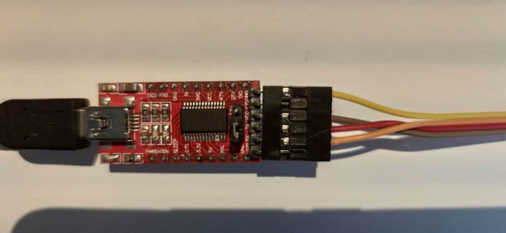
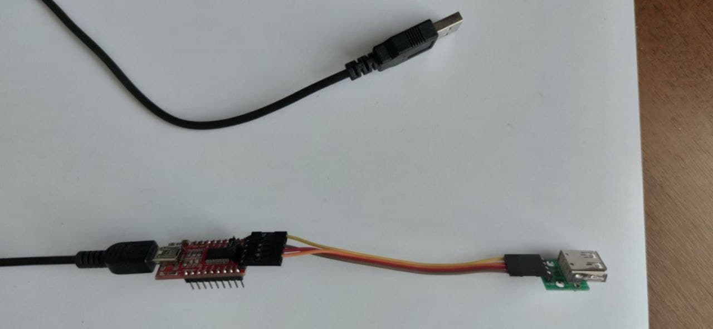
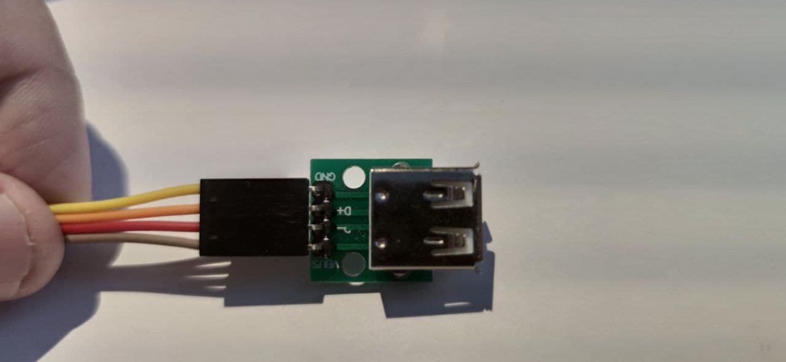
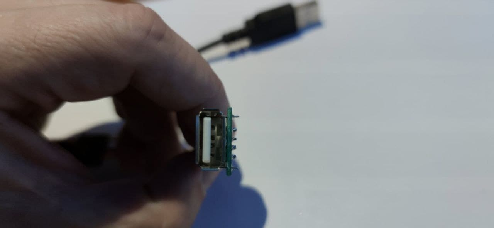

# Flashing device

## Using OTA with ESPHome firmware (only for sticks ordered from me)

You get the ready-made stick from me with the pre-installed [ESPHome](https://esphome.io) firmware compiled with the following YAML config:

```yaml
packages:
  dongle: github://dudanov/iot-uni-dongle/esphome/hardware/iot-uni-dongle.yaml
```

This means that when the stick is powered on, it will works in the access point mode with the network name `iot-uni-dongle` and a simple password `12345678`.

By connecting to this network from your smartphone, you can go to the [captive portal](https://esphome.io/components/captive_portal.html) and enter the parameters of your home Wi-Fi network. I needed to reboot the stick in order for it to connect to my network.

To properly update your firmware based on your configuration using OTA for the first time, you will need set node name to `iot-uni-dongle` and run `$esphome rename your-config.yaml new-node-name`. Read more [here](https://esphome.io/components/esphome.html#changing-esphome-node-name).

```yaml
substitutions:
  node_name: iot-uni-dongle

wifi:
  ssid: !secret wifi_ssid
  password: !secret wifi_password

packages:
  dongle: github://dudanov/iot-uni-dongle/esphome/hardware/iot-uni-dongle.yaml

# following is your config...
```

Thus, you do not need to resort to using the programmer. Congratulations! The migration is complete and you are completely independent of my initial configuration!
[Here](midea-esphome-example.yaml) you can view example YAML config for Midea-like ACs.

## Using the programmer (universal method)

This is a little more complicated and you will need to assemble the programmer if you do not have one.

The stick is flashed using the UART. Thus, we need any USB-UART converter, and a way to connect it to the stick. For example, I flash sticks with such a simple homemade programmer based on FTDI converter.




 

The general connection diagram is as follows:

`TODO: insert connection image`

Next, read the official [ESPHome](https://esphome.io/guides/getting_started_command_line.html#first-uploading) documentation, another preferred firmware, or use [esptool](https://github.com/espressif/esptool) directly.

